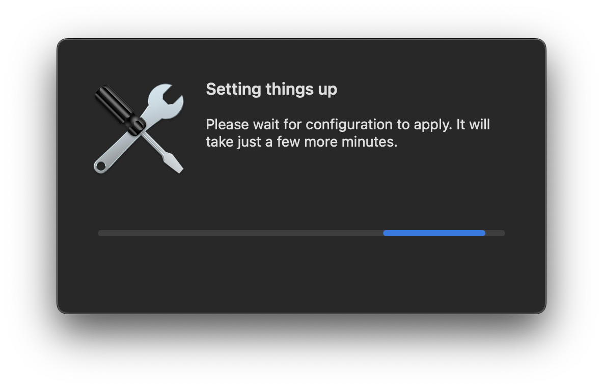
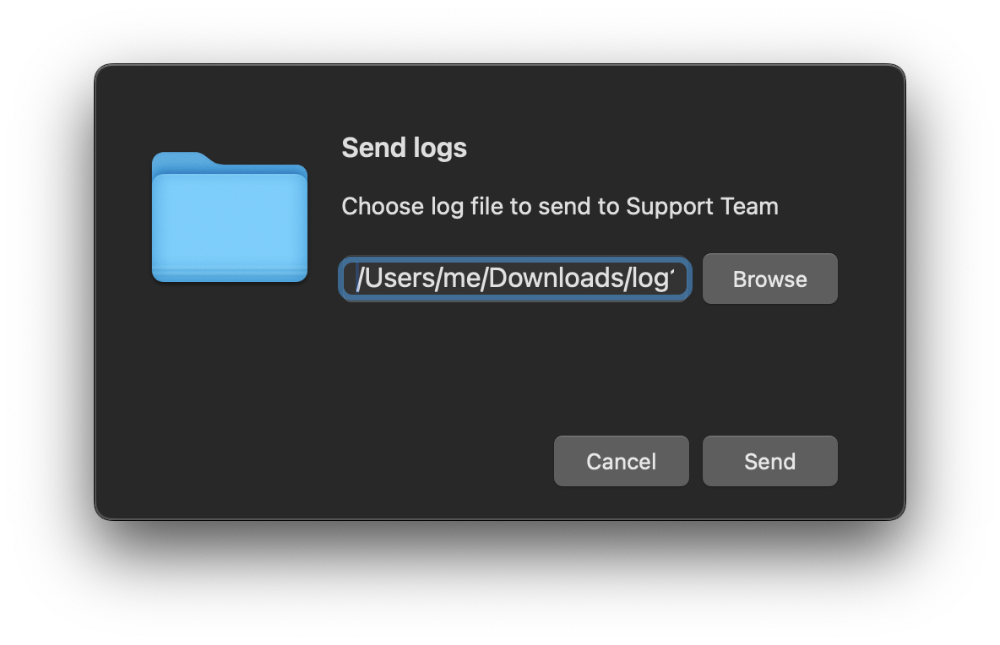

# Yandex Popup
Yandex Popup is a macOS admin tool written in Swift. It allows you to present customizable user interfaces to the user, offering flexible control over the appearance and behavior of window popups and notifications.

## How can I try it?
Latest version of Yandex Popup can be found on the Releases page

By default, Yandex Popup is installed in /Library/Application Support/Yandex Popup.

To view usage information, run the following command in Terminal:
```shell
/Library/Application\ Support/Yandex\ Popup/Yandex\ Popup.app/Contents/MacOS/Yandex\ Popup --help
```

## Control Yandex Popup content and apperance

Yandex Popup provides extensive customization options. You can display macOS-style windows with your own content and controls, or send notifications (including critical notifications that bypass Focus Mode). Customization is done via launch arguments.

Full list of arguments can be viewed under the cut:
<details>
<summary>Launch Arguments</summary>

```
Help:

 --help                                   show this help message and exit

Global parameters:

 --pid-file                               System app pid file, path

Window parameters:

 --window-reset                           Reset window position and size metrics, int [0/1], default is 0
 --window-all-spaces                      Show window on all spaces, int [0/1], default is 0
 --window-title                           Window title visibility, int [0/1], default is 1
 --window-title-text                      Window title text, string, default is 'Yandex.Popup'
 --window-controls                        Window controls bitmask, int [0 - none, 1 - close, 2 - minimize, 4 - fullscreen, 8 - menu], default - 15
 --window-position                        Window semantic position, string [center, left-top, left-bottom, right-top, right-bottom], default - center
 --window-position-x                      Window x position of left-bottom corner, int
 --window-position-y                      Window y position of left-bottom corner, int
 --window-width                           Window width, int
 --window-height                          Window height, int
 --window-floating                        Enables always-on-top floating window, int [0/1], default = 0
 --window-hide-dock                       Disables Window dock and app switcher visibility, int [0/1], default = 0
 --window-focus-element                   Sets Window input element focus, string [none, okbutton, actionbutton, input], default - none

Universal parameters for all windowed popups:

 --popup-type                             Popup type, string [message, input, progress, qrcode, file, dropdown, notification], default is message
 --icon-name                              Generic icon NSImage name, string
 --icon-path                              Generic icon path, string
 --icon-max-width                         Generic icon maximum width, int
 --header-text                            Generic header text, string
 --description-text                       Generic description text, string
 --description-detect-links               Enables generic description links detection, int [0/1], default = 0
 --description-links-layout               Generic description links layout, string, format='start#end#link|...'
 --ok-button                              Generic OK button visibility, int [0/1], default = 1
 --ok-button-text                         Generic OK button text, string
 --action-button                          Generic Action Button visibility, int [0/1], default = 0
 --action-button-actions                  Generic Action button actions set, string, format='launch#app name|open#file path|open_url#url|exit|exit_err'
 --action-button-text                     Generic Action button text, string
 --exit-on-oauth-callback                 Define app behavior after receiving oauth callback (1 - print to stdout and exit immediately, 0 - print and exit only after user interaction), int [0/1], default = 0
 --process-oauth-callback                 Enable OAuth callback processing, int [0/1], default = 0

Input popup parameters:

 --input-text                             Input view initial text, string
 --input-placeholder                      Input view placeholder text, string
 --input-secure                           Input view secure input, int [0/1], default = 0
 --input-secure-set-to-oauth              If set to 1 will put received OAuth token into secure input field, otherwise will add "access_token" to output dictionaary, int [0/1], default = 0

File input popup parameters:

 --file-mode                              FileInput view mode, String [report_path, copy, move], default is report_path
 --file-extension                         FileInput view file extension filter, String
 --file-destination                       FileInput view file destination path, String
 --file-replace                           FileInput view replace destination file, Int [0/1], default = 0
 --file-type                              FileInput view browse mode, String [file, directory], default = file

Progress popup input parameters:

 --progress-type                          Progress view type, String [bar, spinner, completed], default = bar

QR-code popup parameters:

 --qrcode-string                          Qrcode view string, String
 --qrcode-label                           Qrcode label status, int [0/1], default = 1
 --qrcode-label-text                      Qrcode label text, string
 --qrcode-label-text-size                 Qrcode label text size, int [1-inf], default = 20

Dropdown popup parameters:

 --dropdown-items                         Comma-separated drop-down menu items, string, e.g.: --dropdown-items='item1, item2, item3'
 --dropdown-default                       Drop-down menu item chosen by default, string, if not specified will use the first item from the list

Notification parameters:

 --notification-type                      Notification type, string [alert, action]
 --notification-title-text                Notification title, string
 --notification-subtitle-text             Notification subtitle, string
 --notification-body-text                 Notification title, string
 --notification-button                    Show notification button, int [0/1]
 --notification-button-text               Notification button text, string
 --notification-action                    Notification action type, string [launch, open, open_url]
 --notification-action-target             Notification action target, string
 --notification-critical                  Ignore Focus/DnD mode, int [0/1]
 --notification-thread-id                 Group notifications by threadId, string (default: random)
 --notification-fallback-mode             Notification fallback mode if permission not granted, string [disabled, allowed, forced], default = disabled
 --notification-error-on-permission       Notification permission error exit code pass mode [0/1], default = 1
 --notification-fallback-position-origin  Notification fallback position origin point, string [top-left, top-right, bottom-right, bottom-left], default = top-right
 --notification-fallback-padding-x        Notification fallback X-axis padding int, default = 20
 --notification-fallback-padding-y        Notification fallback Y-axis padding int, default = 20
```

</details>


> NOTE: You can also store arguments in a JSON file and pass it via the <mark>YA_POPUP_CONF_FILE</mark> environment variable.

## Usage Examples
### A simple Info message
```shell
/Library/Application\ Support/Yandex\ Popup/Yandex\ Popup.app/Contents/MacOS/Yandex\ Popup \
--window-controls=0 \
--window-title=0 \
--window-height=100 \
--window-width=500  \
--popup-type=message \
--icon-name=NSInfo \
--header-text="Daily fact" \
--description-text="Maine is the only state that has a one-syllable name."
```

### A simple Notification
```shell
/Library/Application\ Support/Yandex\ Popup/Yandex\ Popup.app/Contents/MacOS/Yandex\ Popup \
--popup-type=notification \
--notification-type=action \
--notification-title-text='Hey!' \
--notification-body-text="Want to see something cool?" \
--notification-action="open_url" \
--notification-action-target='https://youtu.be/xvFZjo5PgG0' \
--notification-button-text='Show me!'
```


### A simple progress bar window
```shell
/Library/Application\ Support/Yandex\ Popup/Yandex\ Popup.app/Contents/MacOS/Yandex\ Popup \
--window-title=0 \
--window-width=450 \
--window-controls=0 \
--window-hide-dock=1 \
--window-floating=1 \
--popup-type=progress \
--progress-type=bar \
--icon-name="NSAdvanced" \
--header-text="Setting things up" \
--description-text="Please wait for configuration to apply. It will take just a few more minutes." \
--ok-button=0
```



### File input window with cancellation button
```shell
/Library/Application\ Support/Yandex\ Popup/Yandex\ Popup.app/Contents/MacOS/Yandex\ Popup \
--window-title=0 \
--window-width=450 \
--window-controls=0 \
--window-hide-dock=1 \
--window-floating=1 \
--popup-type=file \
--file-mode=report_path \
--file-extension="log" \
--header-text="Send logs" \
--description-text="Choose log file to send to Support Team" \
--icon-name="NSFolder" \
--ok-button=1 \
--ok-button-text="Send" \
--action-button=1 \
--action-button-text="Cancel" \
--action-button-actions="exit_err"
```



### Processing OAuth callbacks
Yandex Popup supports custom URL scheme <mark>yandex-popup://</mark>. You can setup your OAuth provider to use <mark>yandex-popup://oauth_callback</mark> as a callback URL, so that Yandex Popup could process the callback and pass recieved token to your script

```shell
/Library/Application\ Support/Yandex\ Popup/Yandex\ Popup.app/Contents/MacOS/Yandex\ Popup \
--window-title=0 \
--window-controls=0 \
--popup-type=input \
--input-secure=1 \
--description-text="Please follow this link to generate OAuth token. If you already have OAuth token, you can enter it into the field below" \
--description-detect-links=1 \
--description-links-layout='19#4#https://app.example.com/oauth/' \
--ok-button-text="Proceed" \
--exit-on-oauth-callback=0 \
--input-secure-set-to-oauth=1 \
--process-oauth-callback=1
```


### Using configuration file and dynamically update popup contents
You can save the settings in a JSON file and use the <mark>YA_POPUP_CONF_FILE</mark> environment variable to load them. 
This allows you to update the popup window’s content by editing the file and signaling the app to refresh, without restarting the app.


```shell
POPUP_PATH="/Library/Application Support/Yandex Popup/Yandex Popup.app/Contents/MacOS/Yandex Popup"
POPUP_PID="/tmp/popup_pid"

export YA_POPUP_CONF_FILE="/tmp/popup_config.json"

# Initial setup
plutil -create xml1 "$YA_POPUP_CONF_FILE"
plutil -insert "window-title" -integer 0 "$YA_POPUP_CONF_FILE"
plutil -insert "window-width" -integer 450 "$YA_POPUP_CONF_FILE"
plutil -insert "window-controls" -integer 0 "$YA_POPUP_CONF_FILE"
plutil -insert "window-hide-dock" -integer 1 "$YA_POPUP_CONF_FILE"
plutil -insert "window-floating" -integer 1 "$YA_POPUP_CONF_FILE"
plutil -insert "popup-type" -string "progress" "$YA_POPUP_CONF_FILE"
plutil -insert "progress-type" -string "bar" "$YA_POPUP_CONF_FILE"
plutil -insert "icon-path" -string "/System/Library/CoreServices/CoreTypes.bundle/Contents/Resources/ToolbarCustomizeIcon.icns" "$YA_POPUP_CONF_FILE"
plutil -insert "header-text" -string "Setting things up" "$YA_POPUP_CONF_FILE"
plutil -insert "description-text" -string "Please wait for configuration to apply. It will take just a few more minutes." "$YA_POPUP_CONF_FILE"
plutil -insert "ok-button" -integer 0 "$YA_POPUP_CONF_FILE"
plutil -insert "pid-file" -string "$POPUP_PID" "$YA_POPUP_CONF_FILE"
plutil -convert json "$YA_POPUP_CONF_FILE" -r

# Start Yandex Popup
"$POPUP_PATH" &

# Simulating some work in progress
sleep 2

# Updating the configuration file
sed -i '' "s/\"description-text\" : .*/\"description-text\" : \"Downloading a very important package...\",/" ${YA_POPUP_CONF_FILE}

# Signal Yandex Popup to refresh window content
open yandex-popup://refresh

sleep 2

# Updating the configuration file once more
sed -i '' "s/\"description-text\" : .*/\"description-text\" : \"Installing a very important package...\",/" ${YA_POPUP_CONF_FILE}

# You can also send SUGUSR1 to the Yandex Popup process instead of using custom url scheme
kill -SIGUSR1 $(cat $POPUP_PID)

sleep 2

# Kill Yandex Popup when the work is done
kill $(cat $POPUP_PID)
```


## Rebranding Yandex Popup
You can rebrand Yandex Popup by changing its name, bundle ID, and default icon. This requires building and signing the app manually. For that you will need:
- Apple Developer account
- Provisioning Profile for the app
- Xcode and Command Line Tools
- Developer ID Application signing identity to sign the app
- Developer ID Installer signing identity to sign the installer package (optional)

1. Login into you Apple Developer account at https://developer.apple.com/
2. Register a new app with a unique Bundle Identifier.
3. Create and download a Provisioning Profile for the newly registered app.
4. Make sure that all the necessary signing identities are added to your Login Keychain
5. Get the source code:
    ```
    git clone https://github.com/ya-appleinfra/yandex-popup.git
    ```
6. If you wish to change the default icons, just replace them in Yandex.Popup/Assets.xcassets/AppIcon.appiconset/ directory (ensure proper naming and format)
7. Run the build.sh script, which will guide you through the build process.